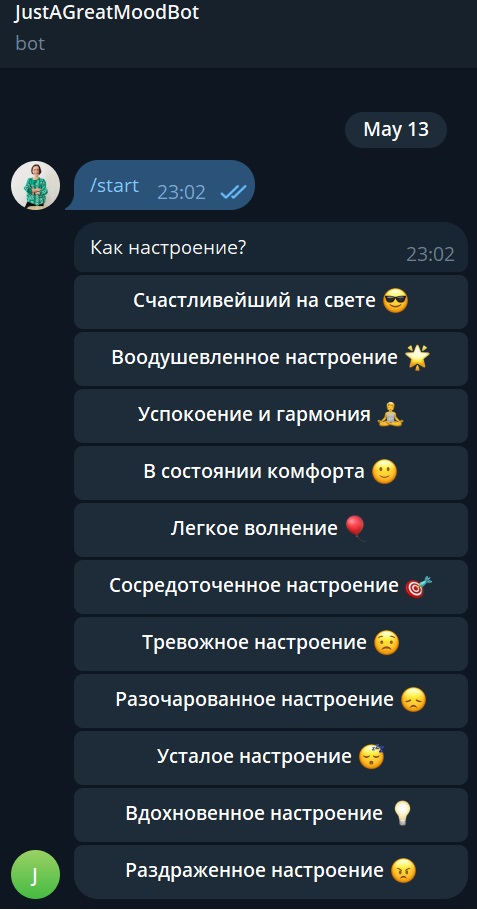
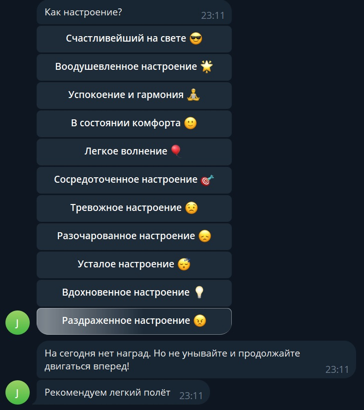

### Телеграмм-бот "Бот-Помощник по Настроению"

#### 1. **Общее описание проекта**
Приложение реализует Телеграмм-бот, обеспечивающий улучшение или поддержание настроения пользователей.

#### **Стек технологий**
Java 17, Spring Boot 3, Maven, Spring Core, Spring AOP и JUnit5

#### 2. **Подробное описание**

##### 2.1 Выбор настроения
- Пользователь должен иметь возможность выбрать текущее настроение из предложенных опций: "Грустно", "Нейтрально", "Весело", "Стресс", "Усталость".
- Бот должен предложить пользователю оценить свое настроение по шкале от 1 до 10.

##### 2.2 Рекомендации на основе настроения
- **Грустно:** Бот должен предоставлять пользователю вдохновляющие цитаты, подборку смешных видео или мемов, а также медитации для снятия грусти.
- **Нейтрально:** Бот должен предлагать интересные статьи, советы по саморазвитию и идеи для новых хобби.
- **Весело:** Бот должен генерировать музыкальные плейлисты, предлагать идеи для развлечений и случайные забавные задания.
- **Стресс:** Бот должен предоставлять дыхательные упражнения, советы по управлению стрессом, а также короткие видео с природными пейзажами.
- **Усталость:** Бот должен предлагать советы по восстановлению энергии, рекомендации по сну и релаксирующие звуки природы.

##### 2.3 Ежедневные напоминания
- Пользователь должен иметь возможность настроить получение ежедневных напоминаний или вдохновляющих сообщений в заданное время.

##### 2.4 Отслеживание настроения
- Бот должен вести журнал настроения пользователя, позволяя ему ежедневно оценивать свое состояние.
- Должна быть возможность просматривать статистику изменения настроения за неделю или месяц.

##### 2.5 Игровые элементы
- Бот должен награждать пользователя за поддержание хорошего настроения и выполнение рекомендаций (например, медитаций или дыхательных упражнений).
- Реализация системы достижений за регулярное использование бота.

##### 2.6 Совместимость с другими сервисами
- Возможность интеграции с музыкальными сервисами для создания персональных плейлистов.
- Подключение к новостным лентам или блогам для предоставления релевантного контента.

#### 3. **Требования к системе**

##### 3.1 Архитектура
- Проект должен использовать Spring Core для управления зависимостями и компонентами.
- Использование Spring AOP для управления кросс-регламентными задачами, такими как логирование, безопасность и обработка исключений.
- Проект должен быть модульным, что позволит легко добавлять новые функции или изменять существующие.

##### 3.2 API
- Использование Telegram Bot API для взаимодействия с пользователями.
- Подключение сторонних API для получения контента (например, API для цитат, медитаций, новостей).

##### 3.3 Тестирование
- Все ключевые модули и компоненты должны быть покрыты юнит-тестами, разработанными с использованием JUnit 5.
- Рекомендуется использование Mock объектов для тестирования интеграций с внешними сервисами.

##### 3.4 Сборка и зависимости
- Использование Maven для управления зависимостями и сборки проекта.
- Файл `pom.xml` должен включать все необходимые зависимости, такие как Spring Framework, JUnit 5 и другие библиотеки.

#### 4. **Требования к интерфейсу**

##### 4.1 Пользовательский интерфейс
- Бот должен взаимодействовать с пользователем через текстовые команды и кнопки Telegram.
- Интерфейс должен быть простым и интуитивно понятным.

##### 4.2 Языковая поддержка
- Бот должен поддерживать русский и английский языки.

#### 5. **Требования к безопасности**
- Бот должен обеспечивать защиту данных пользователя, не допускать утечки личной информации.
- Должны быть реализованы меры защиты от несанкционированного доступа к функционалу бота.

#### 6. **Требования к производительности**
- Бот должен быстро реагировать на команды пользователя, время ответа не должно превышать 2 секунд.
- Система должна поддерживать одновременное взаимодействие с несколькими пользователями без потери производительности.

#### 7. **Документация**
- Проект должен быть документирован, включая README файл с инструкциями по развертыванию и использованию.
- Код должен быть комментирован, поясняя основные моменты логики и сложные участки.

#### 8. **Этапы разработки**

##### 8.1 Этап 1: Проектирование
- Определение архитектуры и компонентов системы.
- Разработка схемы классов и взаимосвязей.

##### 8.2 Этап 2: Разработка базового функционала
- Реализация базовых команд бота: выбор настроения, предоставление рекомендаций.
- Подключение к внешним API для получения контента.

##### 8.3 Этап 3: Разработка дополнительных функций
- Реализация системы отслеживания настроения и ежедневных напоминаний.
- Добавление игровой механики и системы достижений.

##### 8.4 Этап 4: Тестирование
- Разработка и выполнение юнит-тестов.
- Интеграционное тестирование всех компонентов.

##### 8.5 Этап 5: Деплой и поддержка
- Развертывание бота на сервере.
- Настройка мониторинга и логирования.
- Поддержка и обновление бота по мере необходимости.

#### 9. **Заключение**
Данный проект направлен на создание полезного инструмента для пользователей, который поможет им управлять своим эмоциональным состоянием с помощью персонализированных рекомендаций и контента. Реализация на Java с использованием Spring позволит создать надежное и масштабируемое приложение.

### Взаимодействие с приложением

#### Скриншоты

##### *Старт*

##### *Выбранное настроение*

##### *Сводная информация*

### Контакты

- Telegram: [@OlgaIlyina0312](https://t.me/OlgaIlyina0312)
- Email:    [oliljina@mail.ru](oliljina@mail.ru)